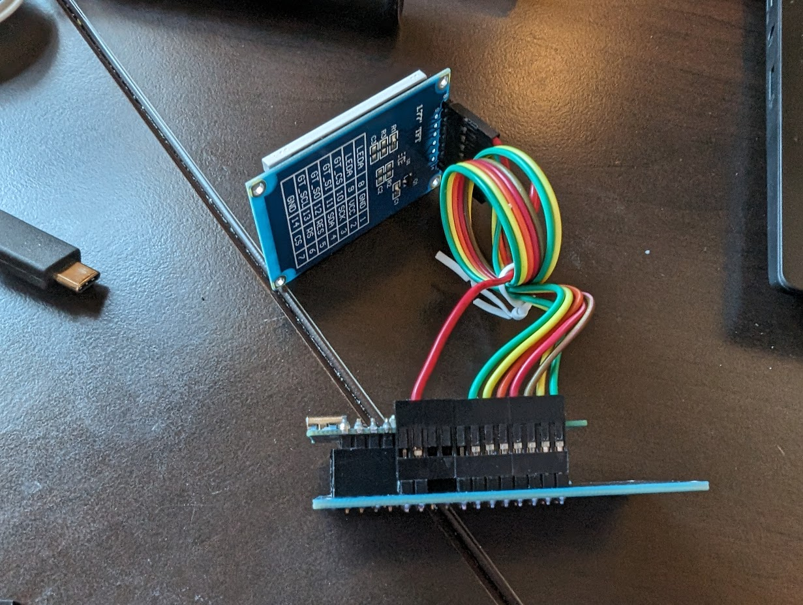
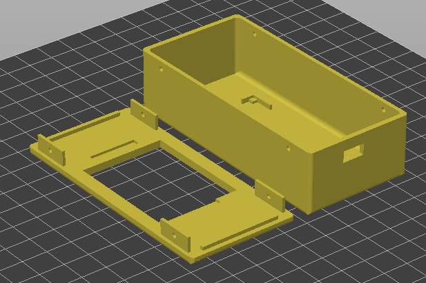
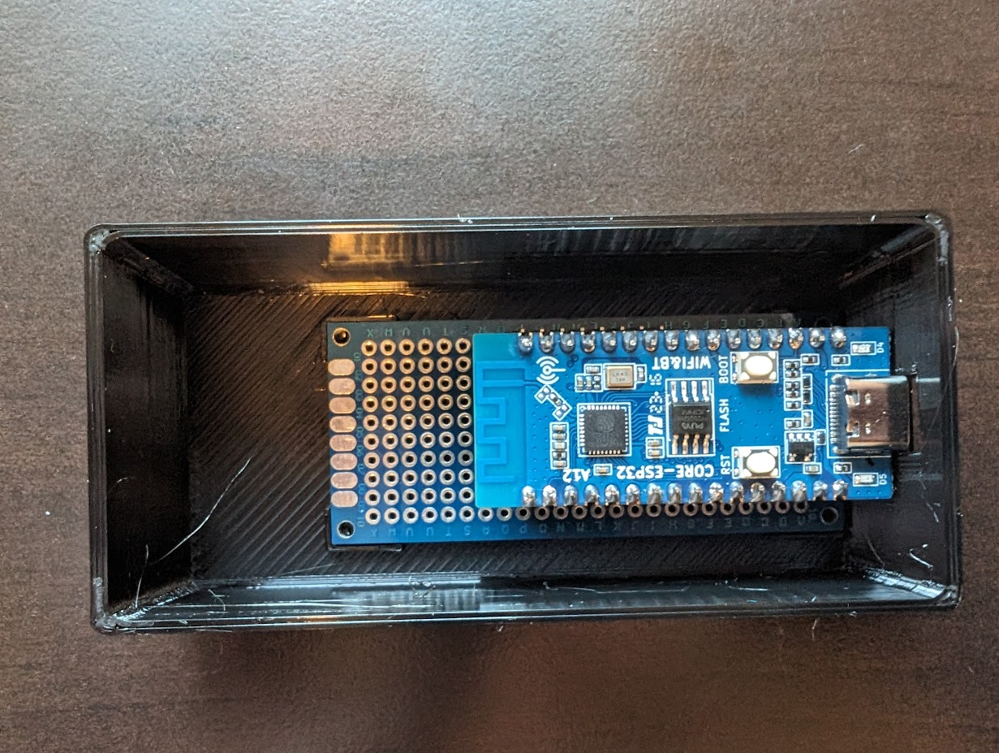
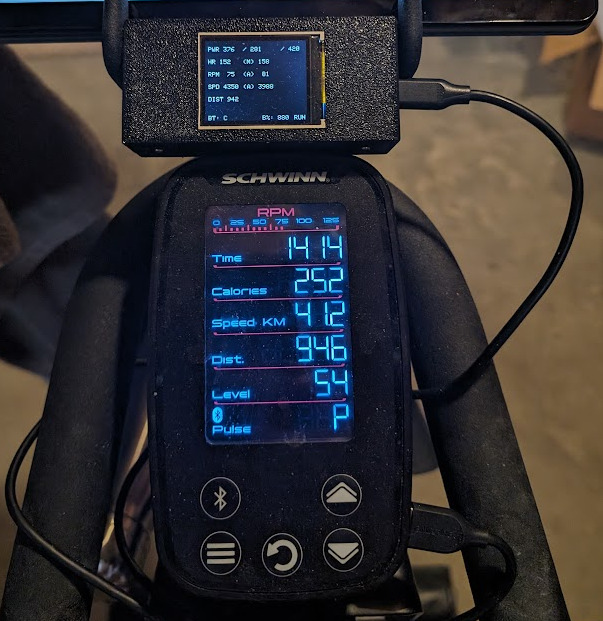

# BikeCU

## Background
BikeCU is an open-source project that enhances the functionality of the Schwinn IC4 indoor cycling bike by providing additional data not available on its built-in display. This includes power (watt) data, integer-style RPM, maximum heart rate, and more. Additionally, BikeCU facilitates the seamless transfer of data to a time-series database, such as InfluxDB, with per-second granularity. Users can then choose to export the data in TCX format for archival purposes and upload it to popular data aggregators like Runalyze or Strava.

While BikeCU has been primarily designed for the Schwinn IC4, it should be versatile enough to work with any BLE-enabled bike.

## Features
- *Power Output Display*: View real-time power output data during your cycling sessions.
- *Improved Cadence Display*: Cadence is shown as an easily readable integer.
- *Auto-connecting to Bike and HR Monitor*: BikeCU ensures a hassle-free connection to your bike and heart rate monitor.
- *HR Monitor Battery Monitoring*: Keep track of your heart rate monitor's battery status.
- *Metric Shuttling to InfluxDB*: Stream data to InfluxDB in per-second granularity for detailed analysis.
- *Export to TCX format*: Choose to export your data in TCX format for archival purposes.
- *Integration with Runalyze and Strava*: Directly export data to popular data aggregators for a comprehensive overview of your cycling performance.
- *Over-the-Air Updating*: Update your BikeCU firmware wirelessly.
- *Data Ownership and Control*: BikeCU prioritizes user data privacy, allowing you to be the owner of your fitness data. You have full control over how and where your data is stored and shared.

## Hardware Required
- ESP32-C3 ([source](https://www.aliexpress.com/item/1005004490215444.html))
- TFT ST7735-based Display (1.77" [source](https://www.aliexpress.com/item/1005003797803015.html))
- USB-A to USB-C cable
- M2 machine screws for case install
- Protoboard (3cm * 7cm)
- Hot-glue gun

While BikeCU has been designed for the ESP32-C3, other ESP32 variants with BLE support should also work. Note that the ESP32-S2 is not compatible.

## Setup


### Project Wiring

| ESP32 | LCD Display |
|---|---|
| GND | GND |
| 3.3V | VCC |
| IO02 | SCK |
| IO03 | SDA |
| IO10 | RES |
| IO06 | RS |
| IO07 | CS |
| IO05 | LEDA |



### Compiling
```sh
git clone https://github.com/precurse/bikecu
pip3 install platformio
pio run
```

### Flashing Firmware
```sh
pio run -v -t upload --upload-port /dev/ttyACM0
```

### Soldering Protoboard
_In progress_

### 3D Printing Case
Print with no supports like so:


Place ESP32 onto protoboard and into the case:


### Final Assembly
- Insert display onto the lid and use hot glue to keep in place
- Place lid onto the case
- Screw four M2 machine screws into the four outside holes
- Final assembly will look like:

